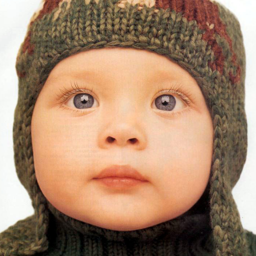

# 使用的数据集

测试图像超分辨率性能使用 Benchmark 数据集，主要选用Set5的几张图片分别应用稀疏表示和局部线性回归两种方法进行测试。

---
# 基于稀疏表示

   基于稀疏表示的超分辨率重构关键在于使用一对过完备字典，分别对应低分辨率和高分
辨率图像。通过使用过完备字典中少量向量的线性组合来表示某个元素（它的列向量有无数种线性组合来表达列向量空间中的任意点，其实就是向量组的极大线性无关组），这些字典中的元素能够有效地表示图像块的不同特征。

下面是基于稀疏表达的超分辨率重构的步骤：
1. **图像分块**：将低分辨率图像分割成区块（patch），每一块将独立进行处理,编码。因此，用于训练的成对数据不是整张的LR-HR图像对，而是所有图像分割开来的区块对
```python
# 提取低分辨率图像的图块  
low_res_patches = []  
for i in range(0, low_res_image.shape[0] - patch_size[0] + 1, stride):  
    for j in range(0, low_res_image.shape[1] - patch_size[1] + 1, stride):  patch = low_res_image[i:i + patch_size[0], j:j + patch_size[1]]  
        low_res_patches.append(patch.reshape(-1))  
# 转换为NumPy数组  
low_res_patches = np.array(low_res_patches) 
```
2. **字典学习**：使用稀疏编码方法，通过对高分辨率图像的训练样本进行字典学习，得到一组稀疏过完备字典Dl和Dh，就可以用它们对LR图像进行重建了。
3. **稀疏编码**：对于每一个图像块，使用学习到的字典找到最佳的稀疏表示。
4. **重构高分辨率图像块**：使用稀疏编码和高分辨率字典，重构每个图像块的高分辨率版本。采用扫描的方式，一个区块一个区块从上到下、从左到右对测试图像进行超分辨率重建。
```python
 # 定义字典学习器的参数  
dictionary_size = 1024  
alpha = 1  
# 创建MiniBatchDictionaryLearning对象  
dl_low_res = MiniBatchDictionaryLearning(n_components=dictionary_size, alpha=alpha)   
# 使用低分辨率图像的图块进行字典学习  
dl_low_res.fit(low_res_patches)  
# 提取测试图像的图块，并根据特征区域进行恢复  
# 提取高分辨率图像的图块  
high_res_patches = []  
for i in range(0, high_res_image.shape[0] - patch_size[0] + 1, stride):  
    for j in range(0, high_res_image.shape[1] - patch_size[1] + 1, stride):  
        patch = high_res_image[i:i + patch_size[0], j:j + patch_size[1]]  
        if is_feature_region(patch):  
            # 使用字典进行稀疏表示  
            sparse_code = dl_low_res.transform(patch.reshape(1, -1))  
            # 从高分辨率字典获取重构结果  
            reconstructed_patch = dl_low_res.components_.T.dot(sparse_code.T).T.reshape((patch_size[0],patch_size[1],3))  
        else:  
            # 对于平滑区域直接用双线性插值进行拉伸  
            reconstructed_patch = cv2.resize(patch, patch_size[::-1], interpolation=cv2.INTER_LINEAR)  
  
        high_res_patches.append(reconstructed_patch) 
```
5. **图像块重组**：将所有重构的高分辨率图像块组合回一个完整的图像。
```python
# 将重构的图块重新组合成图像  
reconstructed_image = np.zeros_like(high_res_image)  
index = 0  
for i in range(0, high_res_image.shape[0] - patch_size[0] + 1, stride):  
    for j in range(0, high_res_image.shape[1] - patch_size[1] + 1, stride):  
        patch = high_res_patches[index]  
        reconstructed_image[i:i + patch_size[0], j:j + patch_size[1]] = patch  
        index += 1
```

---
# 基于局部线性回归方法

方法思想通过从低分辨率图像中学习局部像素之间的关系，来提高图像的分辨率。
下面是基于局部回归的超分辨率重构的步骤：  
1. 数据准备：准备一组成对的低分辨率和高分辨率图像作为训练数据  
2. 特征提取：对于每个低分辨率图像块，需要提取一组特征。这些特征包括颜色、纹理、梯度等。选择适当的块大小和回归模型。块越小，细节恢复越精细，但相应的计算量也更大。  
```python
# 提取低分辨率和高分辨率图像块作为训练数据  
lr_patches = []  
hr_patches = []  
height_lr, width_lr, _ = low_res_image.shape  
for i in range(0, height_lr - block_size_lr + 1, stride_lr):  
    for j in range(0, width_lr - block_size_lr + 1, stride_lr):  
        lr_patch = low_res_image[i:i + block_size_lr, j:j+block_size_lr]  
        hr_patch = high_res_image[i * scale_factor:(i + block_size_lr) * scale_factor,j * scale_factor:(j + block_size_lr) * scale_factor]  
        lr_patches.append(lr_patch.flatten())  
        hr_patches.append(hr_patch.flatten())
```

3. 局部回归模型训练：使用训练数据，建立一个局部线性回归模型，模型的目标是学习低分辨率图像块与其对应的高分辨率图像块之间的映射关系。

```python
# 创建和训练线性回归模型  
X = np.array(lr_patches)  
Y = np.array(hr_patches)  
model = LinearRegression().fit(X, Y)
```
4. 重构过程：对于待重构的低分辨率图像，将其划分为重叠的图像块。对于每个图像块，使用局部回归模型预测其对应的高分辨率图像块。

5. 重叠区域处理：由于图像块之间存在重叠，需要对重叠区域进行处理，这里我使用的是加权平均方法以获得平滑的重构结果，  
```python
# 重建高分辨率图像和重叠区域处理  
reconstructed_image = np.zeros_like(high_res_image, dtype=np.float64)  
weight_sum = np.zeros_like(high_res_image, dtype=np.float64) # 用于加权平均的权重图  
for i in range(0, height_lr - block_size_lr + 1, stride_lr):  
    for j in range(0, width_lr - block_size_lr + 1, stride_lr):
        lr_patch = low_res_image[i:i + block_size_lr, j:j + block_size_lr].flatten()  
        hr_pred = model.predict(lr_patch.reshape(1, -1))  
        hr_pred = hr_pred.reshape(block_size_hr, block_size_hr, -1)  
        # 确保在操作之前将hr_pred转换为float64类型  
        hr_pred = hr_pred.astype(np.float64)  
        # 放置预测的高分辨率块到重建图像  
        start_row_hr = i * scale_factor  
        start_col_hr = j * scale_factor  
        value=reconstructed_image[start_row_hr:start_row_hr + block_size_hr,start_col_hr:start_col_hr + block_size_hr]  
        reconstructed_image[start_row_hr:start_row_hr + block_size_hr,start_col_hr:start_col_hr + block_size_hr] = value+hr_pred  
        # 用于加权平均的权重图更新  
        weight_sum[start_row_hr:start_row_hr + block_size_hr, start_col_hr:start_col_hr + block_size_hr] += 1
# 防止除以零，添加一个小的epsilon  
epsilon = 1e-6  
# 应用加权平均来合并重建的高分辨率图像块  
reconstructed_image = reconstructed_image/(weight_sum + epsilon)
```

# 峰值信噪比（PSNR）

PSNR是用于衡量图像或视频质量的一种指标。它通过比较原始信号与重建信号之间的峰值信号和均方误差来量化重建质量。

```python
def calculate_psnr(original_image, reconstructed_image):  
    # 确保输入图像是float类型以避免溢出  
    original_image = original_image.astype(np.float64)  
    reconstructed_image = reconstructed_image.astype(np.float64)  
    # 计算均方误差 (MSE)    
    mse = np.mean((original_image - reconstructed_image) ** 2)  
    if mse == 0:  
        return float('inf')  # 如果MSE是0，则PSNR有无限大的值  
        print("The PSNR value is infinite")  
    # 计算PSNR  
    max_pixel = 255.0  # 图像像素的最大值  
    psnr = 20 * np.log10(max_pixel / np.sqrt(mse))  
    print(f"The PSNR value is {psnr} dB")
```

---
# 实验结果

以下的图像重构都是基于尺度因子×2的情况下进行的测试，针对不同图像，区块大小和重叠区域等因素都会对重构的效果产生影响。

|         | 图片名     | 测试数据集 | PSNR     |
| ------- | ------- | ----- |----------|
| 稀疏表示法   | birdx2  | Set5  | 36.52dB  |
|         | womanx2 | Set5  | 40.50dB  |
| 局部线性回归法 | babyx2  | Set5  | 36.39 dB |
|         | birdx2  | Set5  | 36.24 dB |

---
## 稀疏表示在set5数据集上的测试

### 原图像


### 重构的图像


---

## 局部线性回归方法在set5数据集上的测试

### 原图像




### 重构的图像


